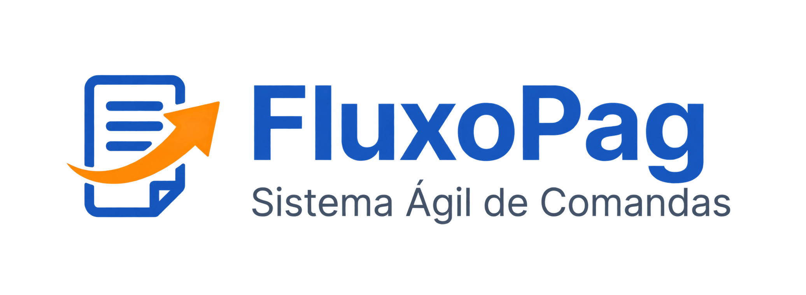
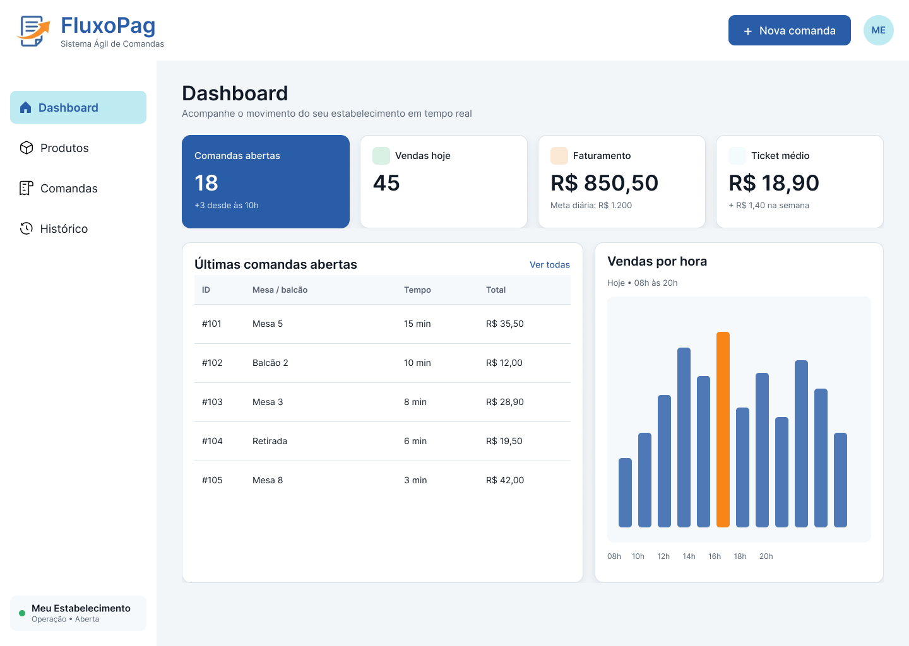

<p align="center"></p>

# FluxoPag — Sistema de Comandas

**Do consumo ao fechamento: produtos, comandas numeradas, pagamentos registrados e visão da operação.**

Aplicação em Python e Flask para padarias, restaurantes, cafés e pequenos estabelecimentos. O FluxoPag associa os itens consumidos a uma comanda reutilizável, calcula o total e preserva a venda depois do fechamento.

[Documentação](docs/README.md) · [Instalação](docs/SETUP.md) · [Design no Figma](https://www.figma.com/design/Rau8PgbGwiiJwRo9MHgzMW/Comandas?node-id=0-1) · [Abrir protótipo](https://www.figma.com/proto/Rau8PgbGwiiJwRo9MHgzMW/Comandas?page-id=0%3A1&node-id=12-2&starting-point-node-id=12%3A2) · [Roadmap](ROADMAP.md) · [Issues](https://github.com/gustavonm20/Sistema-de-comandas/issues) · [Kanban existente](https://github.com/users/gustavonm20/projects/2/views/4)

> **Aplicação em desenvolvimento, disponível para execução local.** O código web e a documentação foram integrados à `main` pela [PR #25](https://github.com/gustavonm20/Sistema-de-comandas/pull/25). A [CI com MySQL real](https://github.com/gustavonm20/Sistema-de-comandas/actions/runs/35213699602) passou: 36 testes da aplicação e seis do terminal histórico. Login, proteção CSRF, migrations e segurança sob concorrência ainda precisam de trabalho. Consulte a [matriz de evidências](docs/STATUS.md) antes de considerar uma funcionalidade concluída.

## Uma operação mais fácil de acompanhar

Durante o atendimento, a equipe precisa saber qual comanda está ocupada, o que foi consumido, quanto deve ser recebido e o que já foi encerrado. Ao final, precisa conferir o dinheiro e consultar os resultados sem perder os atendimentos anteriores.

O objetivo é reunir esse fluxo em uma interface simples: **abrir a operação → atender por comanda → registrar pagamento → conferir o caixa**. A identificação usa um número físico de quatro dígitos; não depende do nome do cliente.

## Como o produto foi pensado



*Prévia de design exportada do Figma em 17/09/2026. Valores e textos são ilustrativos; esta imagem não é uma captura da aplicação funcionando. O arquivo ainda contém detalhes a revisar, como indicadores temporários e números de exemplo com três dígitos.*

A fase de Figma tornou a experiência pretendida concreta: estrutura das telas, sequência de tarefas, estados da operação e identidade FluxoPag. O [guia de design](docs/FIGMA_STATUS.md) explica low-fi, hi-fi, os 16 frames hi-fi encontrados e as diferenças em relação ao código. O ponto de entrada do protótipo foi identificado; a navegação completa ainda precisa de revisão.

## O que existe hoje

| Recurso | Implementação atual | Design |
| --- | --- | --- |
| Produtos: cadastrar, buscar, editar, ativar/desativar | CRUD e persistência verificados com MySQL; revisão visual pendente | Tela hi-fi e low-fi |
| Comandas e itens, total e reutilização | Parcial: fluxo presente; concorrência pendente | Telas principais presentes |
| Pagamento e histórico | Registro local, troco, snapshots e rollback verificados; concorrência pendente | Pagamento e histórico presentes |
| Conta e operação diária | Dados do estabelecimento e caixa presentes; sem autenticação | Conta, abertura, bloqueio e conferência presentes; conexões incompletas |
| Resumos de dia, semana e mês | Três visões por URL; consultas presentes; regras de período parcialmente alinhadas | Três telas hi-fi; comparativos pendentes |
| Tema claro/escuro e menu adaptável | CSS e JavaScript presentes; revisão visual completa pendente | Prévia principal clara |
| Login, CSRF, migrations e estoque | Planejados; estoque é extensão posterior | Nem toda extensão possui tela verificada |

O pagamento é **registrado pelo atendente**. Não há cobrança de cartão, confirmação bancária de Pix ou integração com adquirente. A [matriz completa](docs/STATUS.md) associa recursos, arquivos, verificações e issues.

## Da lógica ao produto

1. **Terminal:** o arquivo [protótipo-inicial.py](protótipo-inicial.py) preserva o treino inicial de Python, principalmente o catálogo em memória. Uma [evolução histórica do terminal](legacy/terminal-json/README.md), recuperada de outro ZIP, usa JSON e tem testes próprios.
2. **Figma:** wireframes e telas detalhadas planejam navegação, estados e identidade visual. Não constituem evidência de testes com clientes.
3. **MySQL:** o schema representa entidades, relacionamentos, preços históricos e restrições de integridade.
4. **Web:** a versão recuperada de `FluxoPag-Flask-MySQL.zip` reúne Flask, templates, estilos, interações e acesso SQL. A consolidação corrige incompatibilidades e torna o código navegável no GitHub.

Consulte a [origem dos arquivos e decisões de integração](docs/PROVENANCE.md).

## Tecnologias e estrutura

| Tecnologia | Uso no projeto |
| --- | --- |
| Python 3.10+ | Validação, regras de negócio, dinheiro com `Decimal` e testes com `unittest` |
| Flask e Jinja | Rotas, formulários, mensagens e geração das páginas HTML |
| HTML e CSS | Estrutura das telas, layout e temas |
| JavaScript | Menu, tema, confirmação e prévia de troco |
| SQL e MySQL 8.0.16+ / 8.4 | Persistência, relações, constraints, views e transações |
| mysql-connector-python | Conexões e consultas SQL parametrizadas |
| python-dotenv | Leitura do `.env` local; variáveis do ambiente têm precedência |

O navegador envia formulários a [app.py](app.py); [services.py](services.py) valida e consulta o banco por [database.py](database.py). O Flask entrega os [templates HTML](templates/) com os [arquivos estáticos](static/). Não há API REST separada nem ORM.

| Caminho | Responsabilidade |
| --- | --- |
| [app.py](app.py), [services.py](services.py), [utils.py](utils.py) | Entrada web, regras e utilitários |
| [database/](database/) | Schema atual, exemplos e schema histórico preservado |
| [initialize_database.py](initialize_database.py) | Inicialização protegida para banco vazio |
| [templates/](templates/), [static/](static/) | Interface e assets recuperados |
| [tests/](tests/) | Verificações locais e integração optativa com MySQL real |
| [docs/](docs/README.md) | Referência técnica, produto, design e gestão |
| [legacy/terminal-json/](legacy/terminal-json/README.md) | Protótipo anterior, isolado da aplicação web |

Veja a [arquitetura](docs/ARCHITECTURE.md), o [modelo de dados](docs/DATABASE.md) e as [rotas](docs/ROUTES.md).

## Executar localmente

Você precisa de Python e de um **MySQL Server em execução**. O Workbench é a interface de administração; ele não substitui o servidor.

```powershell
git clone https://github.com/gustavonm20/Sistema-de-comandas.git
cd Sistema-de-comandas
py -m venv .venv
.\.venv\Scripts\Activate.ps1
python -m pip install -r requirements.txt
Copy-Item .env.example .env
```

Edite `.env` com as credenciais locais e uma chave gerada com `python -c "import secrets; print(secrets.token_hex(32))"`. O [guia de instalação](docs/SETUP.md) mostra como preparar o usuário MySQL, configurar um banco vazio e resolver problemas do PowerShell.

```powershell
python initialize_database.py --user root --ask-password
python app.py
```

Cadastre produtos e inicie a operação em **Conta e operação**. O inicializador recusa bancos que já contêm tabelas: **o schema novo não é uma migration do banco antigo**. Preserve seus dados e consulte [compatibilidade](docs/DATABASE.md).

Linux/macOS usam `python3 -m venv .venv`, `source .venv/bin/activate` e `cp .env.example .env`; o restante é igual. Para o treino inicial, execute separadamente `python "protótipo-inicial.py"`.

```powershell
python -m unittest discover -s tests -v
python scripts/check_docs.py
```

Sem `RUN_MYSQL_TESTS=1`, os testes de banco são explicitamente ignorados. O [guia de verificação](docs/TESTING.md) explica a execução isolada, os resultados obtidos e os limites.

## Regras e limites importantes

- A comanda possui, obrigatoriamente, quatro dígitos e só pode ter um atendimento aberto por vez.
- O fechamento libera o número e preserva pedido, itens e venda.
- Produtos inativos não entram em novos consumos; os itens conservam o preço registrado.
- A aplicação exige preço positivo; o banco mantém a restrição histórica `>= 0`. Produtos gratuitos ainda dependem de decisão explícita.
- A operação precisa estar aberta; o encerramento verifica comandas pendentes e exige justificativa para divergência de caixa.
- Os bloqueios estão no código, mas disputas entre requisições simultâneas ainda precisam ser tratadas e verificadas.
- Resumos atuais seguem a data da venda; o resumo de uma operação encerrada é uma pendência de alinhamento.

Leia as [regras e casos de borda](docs/BUSINESS_RULES.md). Não há implantação desta versão Flask apresentada como pronta para produção.

## Próximos passos e participação

A prioridade é revisar e aceitar o catálogo da [issue #11](https://github.com/gustavonm20/Sistema-de-comandas/issues/11), corrigir a transação sob concorrência na #21 e preparar migrations antes de usar dados existentes. O [roadmap](ROADMAP.md) mantém as fases e dependências; a [política do Kanban](docs/KANBAN.md) distingue propostas de alterações efetivamente aplicadas ao quadro.

[Como contribuir](CONTRIBUTING.md) · [Competências demonstradas](docs/SKILLS.md) · [Histórico de mudanças](CHANGELOG.md) · [Orientações para agentes](AGENTS.md)
