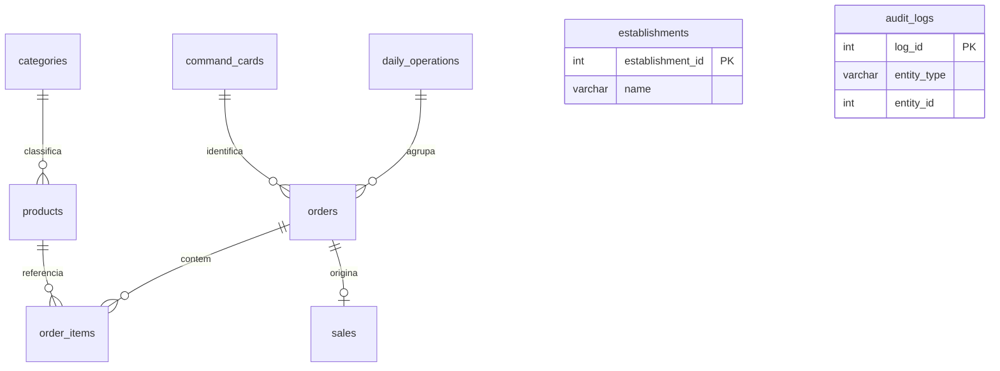

# Banco de dados MySQL

[Índice](README.md) · [Instalação](SETUP.md) · [Regras](BUSINESS_RULES.md) · [Testes](TESTING.md)

A fonte executável é [database/schema.sql](../database/schema.sql). O schema usa `comandas_db`, `utf8mb4` e `utf8mb4_unicode_ci`, nove tabelas e sete views. MySQL 8.0.16+ é necessário para aplicar os `CHECK`; a CI usa MySQL 8.4. `DECIMAL`, colunas geradas, funções de janela e transações são recursos reais deste SQL.

## Entidades

| Tabela | Conteúdo e relações |
| --- | --- |
| `establishments` | Nome, e-mail e tipo do estabelecimento. Aplicação usa ID 1; sem conta de usuário ou senha. |
| `categories` | Nome único, estado ativo e datas. Não há CRUD de categorias na interface atual. |
| `products` | Nome, `normalized_name` único, preço, categoria, estado e datas. FK para `categories`. |
| `command_cards` | Número físico `CHAR(4)` único e reutilizável, estado e datas. |
| `daily_operations` | Abertura/fechamento, saldos, divergência, justificativa e datas. Uma operação aberta por vez. |
| `orders` | Atendimento associado ao cartão e à operação, tipo mesa/balcão/retirada, observação, status e datas. |
| `order_items` | Produto, pedido, quantidade, preço e cópias históricas do nome/categoria. PK `order_item_id`. |
| `sales` | Uma venda por pedido, número histórico do cartão, total, forma de pagamento, recebido, troco e data. |
| `audit_logs` | Ação, entidade, ID, detalhe, data e ator textual fixo. Referência genérica sem FK. |



`establishments` e `audit_logs` aparecem sem linhas porque o schema não declara relações por FK com eles. Um pedido aberto pode não ter itens nem venda; somente o fechamento válido gera uma venda. Não há tabela de clientes ou de estoque.

## Integridade e índices

- `card_number` aceita quatro dígitos ASCII de `0000` a `9999`; o seed cadastra apenas `0001` a `0020`. A aplicação pode cadastrar mais cartões; não existe limite global de vinte na web.
- `orders.open_card_id` é uma coluna gerada: contém `card_id` enquanto o pedido está aberto e `NULL` depois. O índice único impede dois pedidos abertos no mesmo cartão e permite vários históricos, porque MySQL aceita múltiplos `NULL` em uma chave única.
- `daily_operations.open_operation_marker` usa a mesma técnica para garantir uma operação aberta.
- Pedidos e operações exigem coerência entre `status` e `closed_at`. `sales.order_id` é único; `(order_id, product_id)` também é único nos itens.
- FKs preservam referências; não há exclusão em cascata. A interface inativa produtos em vez de apagar histórico.
- Quantidade SQL é positiva; o serviço limita a linha a 99. Preços e total SQL são não negativos; o serviço exige preço de produto positivo. Não confundir essas duas camadas.
- Índices explícitos: `idx_products_category_active`, `idx_orders_status_opened`, `idx_sales_sold_at`, `idx_sales_payment_sold`. Somam-se PKs, índices únicos e índices necessários às FKs. Não foram publicados benchmarks; revisar planos conforme o volume real crescer.

Os snapshots protegem o histórico das mudanças no catálogo, mas SQL direto ainda pode alterar itens ou saldos. Não há trigger que transforme todo acesso SQL em uma operação de negócio segura.

## Views

| View | Finalidade |
| --- | --- |
| `vw_products` | Catálogo com categoria. |
| `vw_open_orders` | Pedidos abertos e total calculado. |
| `vw_order_summary` | Itens, snapshots, subtotal e total por janela do pedido. |
| `vw_sales_history` | Venda com número histórico do cartão e data formatada/bruta. |
| `vw_daily_summary` | Vendas por data; formatação depois da agregação. |
| `vw_weekly_summary` | Agrupamento por `YEARWEEK(sold_at, 1)`. |
| `vw_monthly_summary` | Agrupamento por ano e mês. |

As views são referências SQL; os serviços fazem suas próprias consultas. Consultas e views devem funcionar com `ONLY_FULL_GROUP_BY`; essa proteção não deve ser desativada para encobrir erros. Os resumos não representam necessariamente uma sessão de caixa: sua base é `sales.sold_at`. O teste da virada de ano entre o agrupamento semanal SQL e os intervalos Python ainda deve ser ampliado.

## Inicialização e exemplos

[initialize_database.py](../initialize_database.py) verifica o catálogo `information_schema`, recusa banco com tabelas e executa o schema. Aceita outro nome seguro por `MYSQL_DATABASE`; não importa dump nem faz upgrade. O schema inclui categorias, cartões e estabelecimento fictício, mas deixa produtos e vendas vazios. [demo_seed.sql](../database/demo_seed.sql) acrescenta opcionalmente três produtos de demonstração sem duplicá-los pelo nome normalizado.

Para inspecionar uma instalação nova:

```sql
USE comandas_db;
SHOW TABLES;
SHOW CREATE TABLE orders;
SHOW INDEX FROM sales;
SELECT * FROM vw_products;
```

Consulte [SETUP.md](SETUP.md) para criar usuário e configurar permissões. Execute os testes destrutivos apenas no banco descartável descrito em [TESTING.md](TESTING.md).

## Compatibilidade e evolução

O commit base da `main` usa tabelas em **inglês**, apesar de documentos antigos e da PR #23 mencionarem a tradução para português. Esta consolidação segue o schema efetivamente encontrado e preserva `comandas_db` e a chave `order_items.order_item_id`. O ZIP web usava `item_id`; as queries foram adaptadas com `AS item_id` onde a interface Python precisa desse nome. Isso evita renomear a chave existente para acomodar o arquivo recuperado.

O schema foi ampliado com operação, estabelecimento, auditoria, snapshots e outros campos. Essa evolução **não é compatível automaticamente com um banco já instalado**, mesmo quando os nomes de tabelas coincidem. `IF NOT EXISTS` não migra colunas, índices nem dados. Instalações com tabelas em português também precisam de mapeamento explícito, não de renomeações em massa.

[database/legacy/schema_initial.sql](../database/legacy/schema_initial.sql) preserva integralmente o schema da base auditada para consulta histórica. Ele contém ao final uma consulta a `command_card`, embora a tabela se chame `command_cards`; não é o comando de instalação recomendado.

A [issue #19](https://github.com/gustavonm20/Sistema-de-comandas/issues/19) deve fornecer migrations versionadas, estratégia de preenchimento dos snapshots e associação de pedidos antigos a operações, backup e teste de preservação. Até lá, conserve seu banco anterior e use um banco vazio separado para experimentar a versão consolidada.
