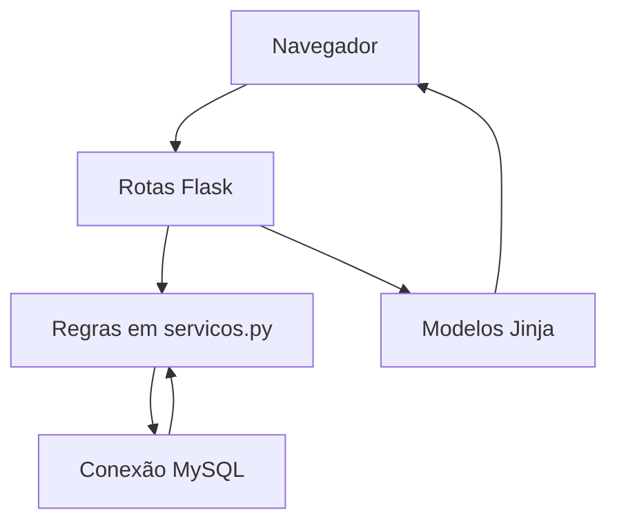

# Arquitetura atual

[Índice](README.md) · [Rotas](ROTAS.md) · [Banco](BANCO_DADOS.md)

O FluxoPag é uma aplicação Flask pequena, com páginas renderizadas no servidor. As responsabilidades foram mantidas próximas do código recuperado, sem ORM, API paralela ou camadas vazias.

| Arquivo / pasta | Responsabilidade |
| --- | --- |
| [aplicacao.py](../aplicacao.py) | Carrega configuração, registra rotas, lê formulário/parâmetros da URL, apresenta mensagens e renderiza modelos. |
| [servicos.py](../servicos.py) | Regras de negócio, validação, consultas parametrizadas, transações e auditoria básica. |
| [banco.py](../banco.py) | Abre uma conexão por contexto Flask em `g`, executa consultas e fecha a conexão ao terminar a requisição. |
| [utilitarios.py](../utilitarios.py) | `Decimal`, normalização, formatação brasileira e limites de calendário. |
| [modelos/](../modelos/) | Jinja e HTML; `base.html` compartilha navegação, mensagens e recursos. |
| [estaticos/](../estaticos/) | CSS, JavaScript puro, logo e ícones. O servidor continua responsável por validar dados. |
| [banco_dados/](../banco_dados/) | Definição SQL, dados iniciais opcionais e estrutura anterior preservada. |
| [inicializar_banco.py](../inicializar_banco.py) | Inicialização explícita de banco vazio, fora das requisições. |

## Fluxo de uma requisição

O navegador envia GET para consultar uma página ou POST com formulário para alterar dados. A rota chama uma função de serviço, que valida a entrada e usa parâmetros `%s` do conector MySQL para os valores. O resultado alimenta um modelo; alterações geralmente redirecionam para uma página e mostram uma mensagem `flash`.

Não há autenticação nem separação de usuários. `estabelecimentos` contém o registro editado pela conta, com ID 1; não representa isolamento entre estabelecimentos. O ator de auditoria é sempre `administrador-local`. A [tarefa #24](https://github.com/gustavonm20/Sistema-de-comandas/issues/24) trata o acesso antes de uma publicação da aplicação.

## Dinheiro e histórico

Valores financeiros são `Decimal` em Python e `DECIMAL(10,2)` em SQL. `converter_valor` aceita entrada brasileira, arredonda para centavos e recusa valores não finitos ou fora da capacidade da coluna. A quantização usa o arredondamento padrão de `Decimal` (`ROUND_HALF_EVEN`); não há política fiscal implementada. O JavaScript mostra uma prévia do troco, mas o servidor refaz o cálculo.

Ao inserir um item, o serviço copia nome, categoria e preço do produto para `itens_pedido`. Consultas históricas usam essas cópias históricas. Alterar ou inativar o produto não recalcula itens anteriores. A tabela permite uma linha por produto/pedido; novas unidades do mesmo produto são somadas à primeira linha e conservam seu preço. A regra para mudança de preço durante um atendimento permanece em discussão.

## Transações

Leituras usam conexão com `autocommit=True`. `executar_com_auditoria` abre uma transação para gravar uma alteração e seu registro de auditoria. Em `fechar_pedido`, a transação bloqueia o pedido com `SELECT ... FOR UPDATE`, verifica itens e pagamento, cria a venda, fecha o pedido e registra a auditoria antes de `commit`. Qualquer erro chama `rollback`; `UNIQUE(vendas.id_pedido)` impede duas vendas para o mesmo pedido.

Isso não torna todo o ciclo seguro sob concorrência: as funções de itens verificam a situação antes de iniciar sua gravação, sem compartilhar o bloqueio do pedido. Da mesma forma, abrir um pedido pode disputar com o fechamento da operação. Esses caminhos precisam do mesmo protocolo de bloqueio e de testes com conexões simultâneas ([#21](https://github.com/gustavonm20/Sistema-de-comandas/issues/21), [#14](https://github.com/gustavonm20/Sistema-de-comandas/issues/14)).

O fechamento de caixa grava saldo esperado, contado e diferença em uma transação. Não inclui sangrias, suprimentos adicionais, estornos ou taxas de cartão.

## Escopo e evolução

As consultas estão no serviço para facilitar a leitura por quem já conhece Python e SQL. Extrair módulos menores faz sentido quando houver uma responsabilidade concreta. Os protótipos de terminal permanecem independentes em seus caminhos históricos; não são importados pelo servidor Flask.

Os resumos usam a data de venda e relógios locais de Python/MySQL. Não há fila, processamento em segundo plano, memória temporária distribuída ou provedor financeiro. Veja os limites e a evidência de execução em [SITUACAO.md](SITUACAO.md).
