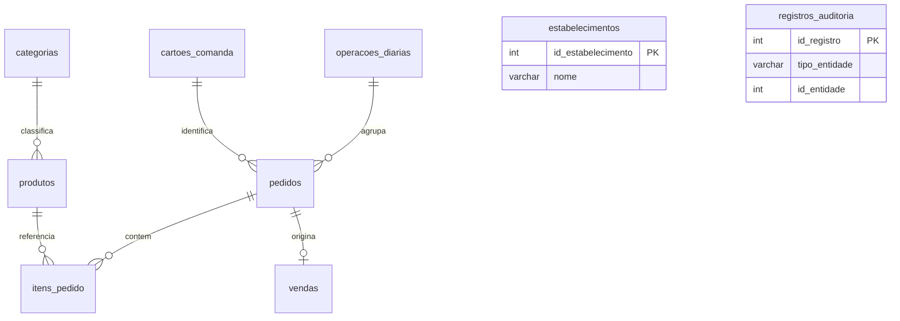

# Banco de dados MySQL

[Índice](README.md) · [Instalação](INSTALACAO.md) · [Regras](REGRAS_NEGOCIO.md) · [Testes](TESTES.md)

A fonte executável é [banco_dados/estrutura.sql](../banco_dados/estrutura.sql). A estrutura usa `comandas`, `utf8mb4` e `utf8mb4_unicode_ci`, nove tabelas e sete visões. MySQL 8.0.16+ é necessário para aplicar os `CHECK`; a integração contínua usa MySQL 8.4. `DECIMAL`, colunas geradas, funções de janela e transações são recursos reais deste SQL.

## Entidades

| Tabela | Conteúdo e relações |
| --- | --- |
| `estabelecimentos` | Nome, e-mail e tipo do estabelecimento. Aplicação usa ID 1; sem conta de usuário ou senha. |
| `categorias` | Nome único, estado ativo e datas. Não há cadastro, consulta, edição e desativação de categorias na interface atual. |
| `produtos` | Nome, `nome_normalizado` único, preço, categoria, estado e datas. FK para `categorias`. |
| `cartoes_comanda` | Número físico `CHAR(4)` único e reutilizável, estado e datas. |
| `operacoes_diarias` | Abertura/fechamento, saldos, divergência, justificativa e datas. Uma operação aberta por vez. |
| `pedidos` | Atendimento associado ao cartão e à operação, tipo mesa/balcão/retirada, observação, situação e datas. |
| `itens_pedido` | Produto, pedido, quantidade, preço e cópias históricas do nome/categoria. PK `id_item_pedido`. |
| `vendas` | Uma venda por pedido, número histórico do cartão, total, forma de pagamento, recebido, troco e data. |
| `registros_auditoria` | Ação, entidade, ID, detalhe, data e ator textual fixo. Referência genérica sem FK. |



`estabelecimentos` e `registros_auditoria` aparecem sem linhas porque a estrutura não declara relações por FK com eles. Um pedido aberto pode não ter itens nem venda; somente o fechamento válido gera uma venda. Não há tabela de clientes ou de estoque.

## Integridade e índices

- `numero_cartao` aceita quatro dígitos ASCII de `0000` a `9999`; os dados iniciais cadastra apenas `0001` a `0020`. A aplicação pode cadastrar mais cartões; não existe limite global de vinte na web.
- `pedidos.id_cartao_aberto` é uma coluna gerada: contém `id_cartao` enquanto o pedido está aberto e `NULL` depois. O índice único impede dois pedidos abertos no mesmo cartão e permite vários históricos, porque MySQL aceita múltiplos `NULL` em uma chave única.
- `operacoes_diarias.marcador_operacao_aberta` usa a mesma técnica para garantir uma operação aberta.
- Pedidos e operações exigem coerência entre `situacao` e `fechado_em`. `vendas.id_pedido` é único; `(id_pedido, id_produto)` também é único nos itens.
- FKs preservam referências; não há exclusão em cascata. A interface inativa produtos em vez de apagar histórico.
- Quantidade SQL é positiva; o serviço limita a linha a 99. Preços e total SQL são não negativos; o serviço exige preço de produto positivo. Não confundir essas duas camadas.
- Índices explícitos: `indice_produtos_categoria_ativo`, `indice_pedidos_situacao_abertura`, `indice_vendas_data`, `indice_vendas_pagamento_data`. Somam-se PKs, índices únicos e índices necessários às FKs. Não foram publicados medições de desempenho; revisar planos conforme o volume real crescer.

As cópias históricas protegem o histórico das mudanças no catálogo, mas SQL direto ainda pode alterar itens ou saldos. Não há gatilho que transforme todo acesso SQL em uma operação de negócio segura.

## Visões

| Visão | Finalidade |
| --- | --- |
| `visao_produtos` | Catálogo com categoria. |
| `visao_pedidos_abertos` | Pedidos abertos e total calculado. |
| `visao_resumo_pedidos` | Itens, cópias históricas, subtotal e total por janela do pedido. |
| `visao_historico_vendas` | Venda com número histórico do cartão e data formatada/bruta. |
| `visao_resumo_diario` | Vendas por data; formatação depois da agregação. |
| `visao_resumo_semanal` | Agrupamento por `YEARWEEK(vendido_em, 1)`. |
| `visao_resumo_mensal` | Agrupamento por ano e mês. |

As visões são referências SQL; os serviços fazem suas próprias consultas. Consultas e visões devem funcionar com `ONLY_FULL_GROUP_BY`; essa proteção não deve ser desativada para encobrir erros. Os resumos não representam necessariamente uma sessão de caixa: sua base é `vendas.vendido_em`. O teste da virada de ano entre o agrupamento semanal SQL e os intervalos Python ainda deve ser ampliado.

## Inicialização e exemplos

[inicializar_banco.py](../inicializar_banco.py) verifica o catálogo `information_schema`, recusa banco com tabelas e executa a estrutura. Aceita outro nome seguro por `MYSQL_BANCO`; não importa cópia exportada nem faz atualização. A estrutura inclui categorias, cartões e estabelecimento fictício, mas deixa produtos e vendas vazios. [dados_exemplo.sql](../banco_dados/dados_exemplo.sql) acrescenta opcionalmente três produtos de demonstração sem duplicá-los pelo nome normalizado.

Para inspecionar uma instalação nova:

```sql
USE comandas;
SHOW TABLES;
SHOW CREATE TABLE pedidos;
SHOW INDEX FROM vendas;
SELECT * FROM visao_produtos;
```

Consulte [INSTALACAO.md](INSTALACAO.md) para criar usuário e configurar permissões. Execute os testes destrutivos apenas no banco descartável descrito em [TESTES.md](TESTES.md).

## Compatibilidade e evolução

O banco continua sendo **MySQL**, com valores `DECIMAL(10,2)`. A tradução altera nomes de tabelas, colunas, configurações e valores enumerados; não converte o sistema para SQLite. O nome padrão da instalação nova é `comandas`.

A versão Flask anterior usa nove tabelas com nomes em inglês. [migrar_banco.py](../migrar_banco.py) copia essa versão para um banco novo em português. Preserva identificadores, relações, valores monetários, datas e textos salvos; converte somente nomes de campos e códigos conhecidos. As colunas geradas são recalculadas pelo MySQL. O programa compara todos os valores copiados antes de confirmar a transação.

Antes de executar, faça uma cópia de segurança e interrompa as gravações na aplicação antiga. A origem deve usar InnoDB e corresponder às nove tabelas esperadas. O destino deve ser novo ou vazio, no mesmo servidor MySQL.

```powershell
python migrar_banco.py --origem comandas_db --destino comandas --usuario root --solicitar-senha --operacao-parada
```

O programa recusa origem igual ao destino, destino ocupado e estrutura desconhecida. A origem não recebe comandos de alteração. Se a cópia falhar, a transação do destino é revertida; a estrutura vazia pode permanecer, pois comandos de criação do MySQL não participam dessa reversão. Não execute o inicializador antes da migração: a própria migração cria o destino sem dados de exemplo.

Após conferir a cópia, ajuste `MYSQL_BANCO=comandas` e as outras variáveis conforme [.env.exemplo](../.env.exemplo). Conceda ao usuário da aplicação acesso ao destino antes de iniciá-la. Se precisar voltar, use o código anterior com o banco original; nenhuma sincronização posterior entre os bancos é feita. A sequência numérica automática retoma a partir dos identificadores copiados; lacunas acima do maior identificador não são preservadas.

Este conversor não cobre a estrutura mais antiga do protótipo nem alterações particulares no banco. [banco_dados/legado/estrutura_inicial.sql](../banco_dados/legado/estrutura_inicial.sql) mantém a estrutura histórica com os nomes traduzidos para estudo; não é o instalador da aplicação. A versão original continua disponível no histórico Git. A evolução geral de migrações e outros formatos antigos continua na [tarefa #19](https://github.com/gustavonm20/Sistema-de-comandas/issues/19).
